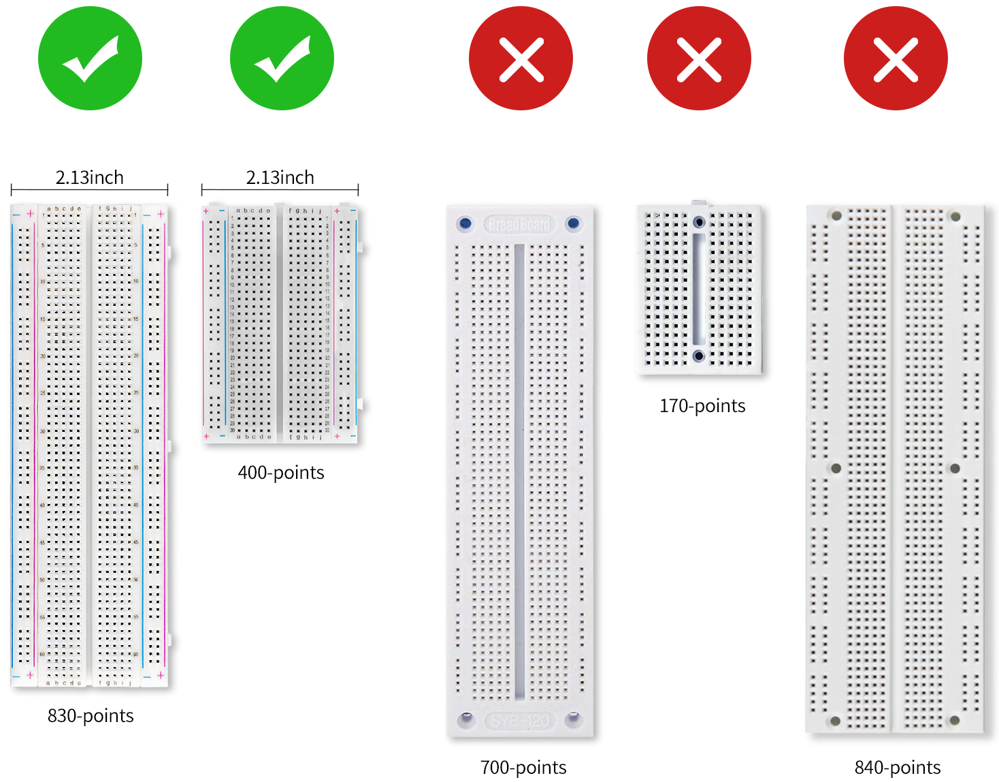

FAQ
============

1. Compatible Breadboards
---------------------------

The BreadVolt is compatible with commonly available breadboards on the market, which have a width of 2.13 inches. There are also some breadboards that are not compatible, as shown in the image below:

