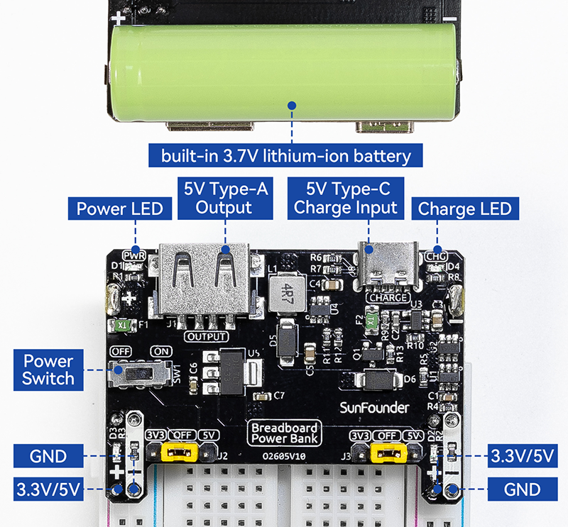
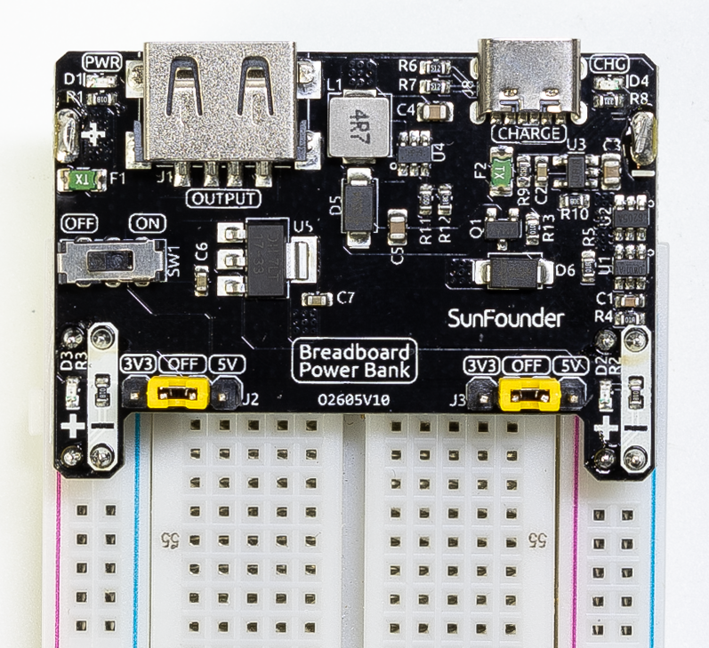
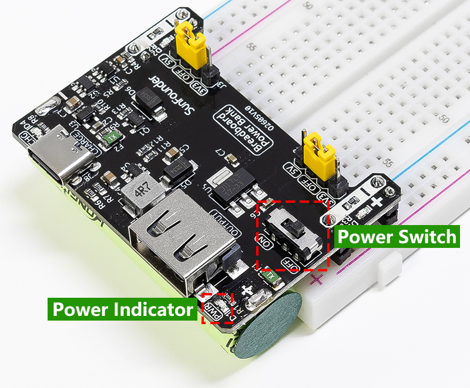
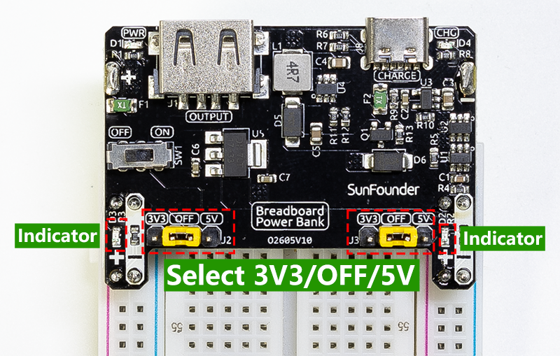
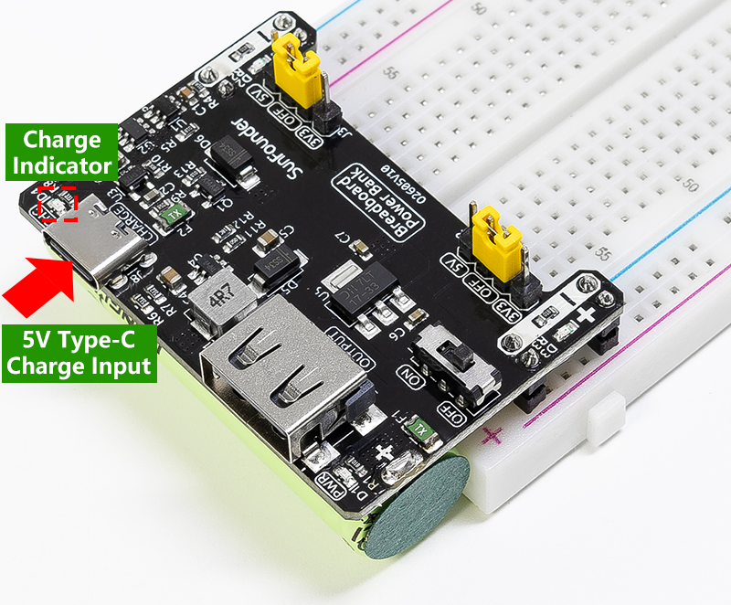

.. note::

    Hello, welcome to the SunFounder Raspberry Pi & Arduino & ESP32 Enthusiasts Community on Facebook! Dive deeper into Raspberry Pi, Arduino, and ESP32 with fellow enthusiasts.

    **Why Join?**

    - **Expert Support**: Solve post-sale issues and technical challenges with help from our community and team.
    - **Learn & Share**: Exchange tips and tutorials to enhance your skills.
    - **Exclusive Previews**: Get early access to new product announcements and sneak peeks.
    - **Special Discounts**: Enjoy exclusive discounts on our newest products.
    - **Festive Promotions and Giveaways**: Take part in giveaways and holiday promotions.

    👉 Ready to explore and create with us? Click [|link_sf_facebook|] and join today!

Hardware Introductions
==============================

**Features**

* **Battery**: 3.7V 14500 Li-ion battery, 500mAh
* **Output**: 5V/1.5A, 3.3V/1A (adjustable via jumpers. 0V, 3.3V, and 5V configuration)
* **Output**: USB (Type-A) 5V
* **Charge Input**: USB Type-C, 5V
* **Charging Current**: 500mA
* **Shutdown Current**: < 0.5mA
* **Lithium Battery Over-discharge Protection Voltage**: 2.4V
* **Lithium Battery Overcharge Protection Voltage**: 4.28V
* Onboard Charging Indicator (CHG)
* Onboard Power Indicator (PWR)
* ON-OFF Switch Available
* **Dimension**: 52mm x 32mm x 24mm (L x W x H)

**Pinout**

**Inserting into Breadboard**

The module is directly installed at one end of the breadboard. The four 2-pin headers on the back of the module are used for the breadboard's power pathway. It is recommended that the negative side be inserted into the corresponding holes of the blue/black line of the breadboard.

.. image:: img/plugin_breadboard2.png
    :width: 400
    :align: center

**Power Switch**

Toggle the switch to the **ON** position to turn on the board switch. The **PWR** green light will light up, and at this time the USB Type A port outputs 5V. The power sources of the two pathways on the breadboard are selected via jumper caps.

**3V3/5V Pin Headers Output**

The J2 and J3 headers on the board control the switching and voltage selection of the power pathways on each side using jumper caps. Placing the jumper cap on the middle 2Pin (OFF) disconnects the output, which can be seen as the LEDs on both pathways will turn off. Moving the jumper cap to the 3V3 or 5V sections controls the output of 3.3V or 5V respectively.

**Power Pathways**

The USB Type C input is partially used for charging and partially outputs directly to USB Type A, the 5V pin output, and the input of the 3.3V linear regulator.

**Charging**

When a 5V power source is plugged into the USB Type C port, it can charge the battery, and the **CHG** red light will light up to indicate charging, going off when fully charged.

**Battery Protection**

* **Over-discharge Protection**: When the battery voltage drops below 2.4V, battery protection activates, and the battery will no longer discharge. Inserting the charger and charging above 3.0V deactivates the over-discharge protection.
* **Overcharge Protection**: When the total battery voltage reaches 4.28V, charging stops. The voltage dropping to 4.08V deactivates the overcharge protection.
* **Overcurrent Protection**: Overcurrent protection is around 3.75A.
* **Short Circuit Protection**: Short circuit protection is around 32A.
