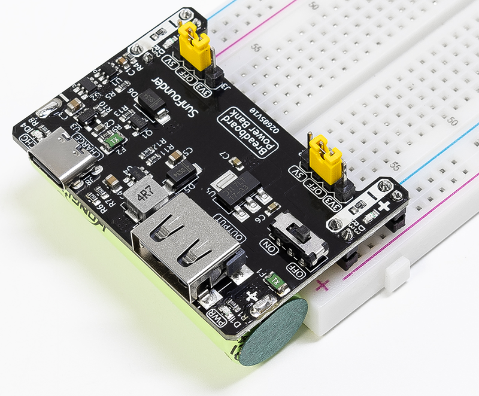

.. note::

    こんにちは、SunFounderのRaspberry Pi & Arduino & ESP32愛好家コミュニティへようこそ！Facebook上でRaspberry Pi、Arduino、ESP32についてもっと深く掘り下げ、他の愛好家と交流しましょう。

    **参加する理由は？**

    - **エキスパートサポート**：コミュニティやチームの助けを借りて、販売後の問題や技術的な課題を解決します。
    - **学び＆共有**：ヒントやチュートリアルを交換してスキルを向上させましょう。
    - **独占的なプレビュー**：新製品の発表や先行プレビューに早期アクセスしましょう。
    - **特別割引**：最新製品の独占割引をお楽しみください。
    - **祭りのプロモーションとギフト**：ギフトや祝日のプロモーションに参加しましょう。

    👉 私たちと一緒に探索し、創造する準備はできていますか？[|link_sf_facebook|]をクリックして今すぐ参加しましょう！

ハードウェア紹介
==============================

**特長**

* **バッテリー**: 3.7V 14500リチウムイオンバッテリー、500mAh
* **出力**: 5V/1.5A、3.3V/1A（ジャンパーで調整可能。0V、3.3V、5V設定）
* **出力**: USB（タイプA）5V
* **充電入力**: USBタイプC、5V
* **充電電流**: 500mA
* **シャットダウン電流**: < 0.5mA
* **リチウムバッテリー過放電保護電圧**: 2.4V
* **リチウムバッテリー過充電保護電圧**: 4.28V
* 充電インジケータ（CHG）搭載
* 電源インジケータ（PWR）搭載
* ON-OFFスイッチ付き
* **寸法**: 52mm x 32mm x 24mm (L x W x H)

**ピンアウト**

.. image:: img/power_bank_pinout.png
    :width: 500
    :align: center

**ブレッドボードへの挿入**

モジュールはブレッドボードの一端に直接設置されます。モジュール背面の4つの2ピンヘッダーは、ブレッドボードの電源経路用です。ブルー/ブラックラインの対応する穴にマイナス側を挿入することを推奨します。

.. image:: img/plugin_breadboard.png
    :width: 400
    :align: center

**電源スイッチ**

スイッチを **ON** 位置に切り替えると、ボードのスイッチがオンになります。 **PWR** の緑色ライトが点灯し、このときUSBタイプAポートから5Vが出力されます。ブレッドボードの2つの経路の電源はジャンパーキャップを介して選択されます。

**3V3/5Vピンヘッダー出力**

ボード上のJ2とJ3ヘッダーは、ジャンパーキャップを使って各側の電源経路の切替と電圧選択を制御します。ジャンパーキャップを中央の2Pin（OFF）に置くと出力が遮断され、両経路のLEDが消灯するのが確認できます。ジャンパーキャップを3V3または5Vセクションに移動させると、それぞれ3.3Vまたは5Vの出力を制御します。

.. image:: img/select_power.png
    :width: 500
    :align: center

**電源経路**

USBタイプC入力は一部が充電用、一部がUSBタイプA、5Vピン出力、および3.3Vリニアレギュレータの入力に直接出力されます。

**充電**

USBタイプCポートに5V電源が接続されると、バッテリーが充電され、 **CHG** の赤色ライトが点灯して充電中であることを示します。完全に充電されると消灯します。

.. image:: img/power_charge.png
    :width: 500
    :align: center

**バッテリー保護**

* **過放電保護**: バッテリー電圧が2.4V以下に下がると、バッテリー保護が作動し、バッテリーは放電されなくなります。充電器を差し込み、3.0V以上に充電すると過放電保護が解除されます。
* **過充電保護**: バッテリーの総電圧が4.28Vに達すると充電が停止します。電圧が4.08Vに下がると過充電保護が解除されます。
* **過電流保護**: 約3.75Aで過電流保護が作動します。
* **ショートサーキット保護**: 約32Aでショートサーキット保護が作動します。

