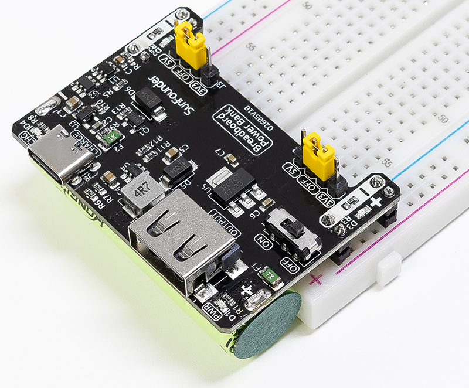

.. note::

    こんにちは、SunFounderのRaspberry Pi & Arduino & ESP32愛好家コミュニティへようこそ！Facebook上でRaspberry Pi、Arduino、ESP32についてもっと深く掘り下げ、他の愛好家と交流しましょう。

    **参加する理由は？**

    - **エキスパートサポート**：コミュニティやチームの助けを借りて、販売後の問題や技術的な課題を解決します。
    - **学び＆共有**：ヒントやチュートリアルを交換してスキルを向上させましょう。
    - **独占的なプレビュー**：新製品の発表や先行プレビューに早期アクセスしましょう。
    - **特別割引**：最新製品の独占割引をお楽しみください。
    - **祭りのプロモーションとギフト**：ギフトや祝日のプロモーションに参加しましょう。

    👉 私たちと一緒に探索し、創造する準備はできていますか？[|link_sf_facebook|]をクリックして今すぐ参加しましょう！

SunFounder |link_breadvolt| ブレッドボード電源モジュール
===================================================================

私たちの|link_breadvolt|をお選びいただきありがとうございます。

.. note::
    この文書は以下の言語で利用可能です。

        * |link_german_tutorials|
        * |link_jp_tutorials|
        * |link_en_tutorials|
    
    各リンクをクリックして、ご希望の言語で文書にアクセスしてください。

SunFounder |link_breadvolt| は、Arduino、Raspberry Pi、ESP32、Pico Wなどに対応する、あらゆる電子プロジェクトに5V/1.5Aおよび3.3V/1Aの出力を提供する、ワンストップのブレッドボード電源ソリューションです。内蔵の3.7V 14500リチウムイオンバッテリー（500mAh）を搭載しており、電源がない場所でもいつでも作業が可能です。 |link_breadvolt| は、ジャンパーキャップを介して5Vと3.3Vを調整することで、正確で安定した電源出力を保証します。初心者にも使いやすいインターフェイスには、オン/オフスイッチがあり、コンパクトな設計（52mm x 32mm x 24mm）で設置と使用が簡単です。用途の広い |link_breadvolt| には、2つの独立したチャンネルとUSB（タイプA）出力があり、IoT、ロボティクス、さまざまなプロジェクトに最適です。

**特徴**

* **バッテリー**: 3.7V 14500リチウムイオンバッテリー、500mAh
* **出力**: 5V/1.5A、3.3V/1A（ジャンパーで調整可能。0V、3.3V、5Vの設定）
* **出力**: USB（タイプA）5V
* **充電入力**: USBタイプC、5V
* **充電電流**: 500mA
* **シャットダウン電流**: < 0.5mA
* **リチウムバッテリー過放電保護電圧**: 2.4V
* **リチウムバッテリー過充電保護電圧**: 4.28V
* 充電インジケータ（CHG）搭載
* 電源インジケータ（PWR）搭載
* ON-OFFスイッチ付き
* **寸法**: 52mm x 32mm x 24mm (L x W x H)

**目次**

.. toctree::
    :maxdepth: 2

    About this Kit <self>
    hardware_introduction
    projects/projects
    downloads

**著作権告知**

このマニュアルに含まれるテキスト、画像、コードなどのすべてのコンテンツは、SunFounder社が所有しています。関連する規制と著作権法の下で、個人的な学習、調査、楽しみ、その他の商業的でない、または非営利的な目的のためにのみ使用してください。作者及び関連する権利保持者の法的権利を侵害せずに使用してください。許可なくこれらを商業的利益のために使用する個人または組織に対しては、会社は法的措置を取る権利を留保します。