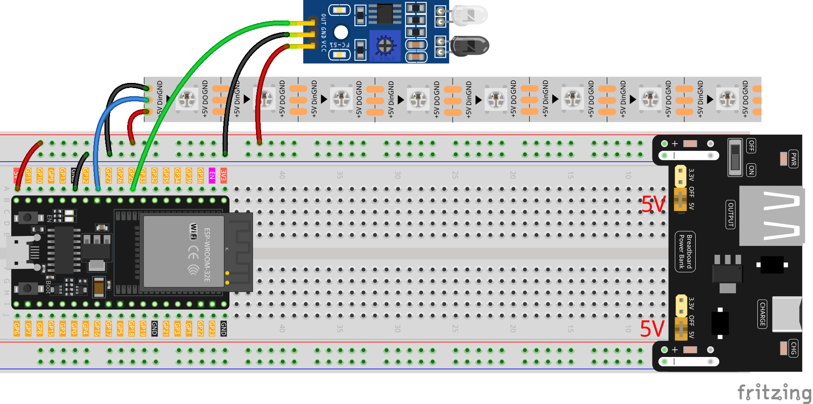

.. note::

    こんにちは、SunFounderのRaspberry Pi & Arduino & ESP32愛好家コミュニティへようこそ！Facebook上でRaspberry Pi、Arduino、ESP32についてもっと深く掘り下げ、他の愛好家と交流しましょう。

    **参加する理由は？**

    - **エキスパートサポート**：コミュニティやチームの助けを借りて、販売後の問題や技術的な課題を解決します。
    - **学び＆共有**：ヒントやチュートリアルを交換してスキルを向上させましょう。
    - **独占的なプレビュー**：新製品の発表や先行プレビューに早期アクセスしましょう。
    - **特別割引**：最新製品の独占割引をお楽しみください。
    - **祭りのプロモーションとギフト**：ギフトや祝日のプロモーションに参加しましょう。

    👉 私たちと一緒に探索し、創造する準備はできていますか？[|link_sf_facebook|]をクリックして今すぐ参加しましょう！

Flowing Light with ESP32 
====================================================================

このプロジェクトでは、ESP32 WROOM 32Eと障害物回避モジュール、WS2812 RGB LEDストリップを使用して、流れる光の効果を作成します。セットアップには、ランダムに色が変わる8つのLEDが含まれており、障害物を検出すると光の流れの方向が反転します。障害物の検出はESP32に接続された赤外線センサーで行い、LEDストリップは ``Adafruit NeoPixel`` ライブラリを使用して制御します。

**必要なコンポーネント**

このプロジェクトでは、以下のコンポーネントが必要です。

* ESP32 WROOM 32E
* 障害物回避モジュール
* WS2812 RGB 8 LEDs ストリップ
* |link_breadvolt|
* 400穴ブレッドボード
* ジャンパーワイヤー

**配線図**

**コード**

.. note::

    ここでは ``Adafruit NeoPixel`` ライブラリを使用します。ライブラリマネージャからインストールできます。

.. code-block:: Arduino

    #include <Adafruit_NeoPixel.h>

    // Set the number of pixels for the running light
    #define NUM_PIXELS 8

    // Set the data pin for the RGB LED strip
    #define DATA_PIN 14

    // Initialize the RGB LED strip object
    Adafruit_NeoPixel pixels(NUM_PIXELS, DATA_PIN, NEO_GRB + NEO_KHZ800);

    // Initialize the avoid sensor
    #define AVOID_PIN 25

    void setup() {
        // Initialize the RGB LED strip
        pixels.begin();
        
        // Initialize the avoid sensor
        pinMode(AVOID_PIN, INPUT_PULLUP);
        
        // Set the initial LED color
        uint32_t color = pixels.Color(random(256), random(256), random(256));
        pixels.fill(color);
        pixels.show();
    }

    void loop() {
        // Read the input from the infrared sensor
        bool avoid_value = digitalRead(AVOID_PIN);

        // Generate a random color for the current pixel
        uint32_t color = pixels.Color(random(256), random(256), random(256));

        // If no obstacle is detected
        if (avoid_value) {
            for (int i = 0; i < NUM_PIXELS; i++) {
                // Turn on the current pixel with the random color
                pixels.setPixelColor(i, color);

                // Update the RGB LED strip display
                pixels.show();

                // Turn off the current pixel
                pixels.setPixelColor(i, 0);
                delay(100);
            }
        }
        // If detects an obstacle, change the direction of the LED strip
        else {
            for (int i = NUM_PIXELS - 1; i >= 0; i--) {
                pixels.setPixelColor(i, color);
                pixels.show();
                pixels.setPixelColor(i, 0);
                delay(100);
            }
        }
    }
