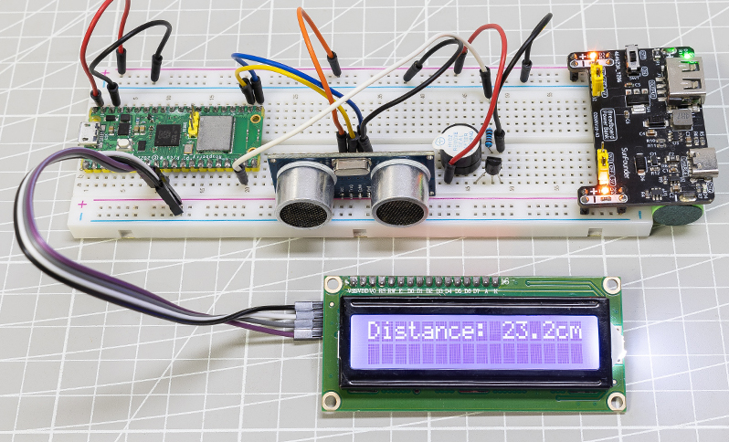
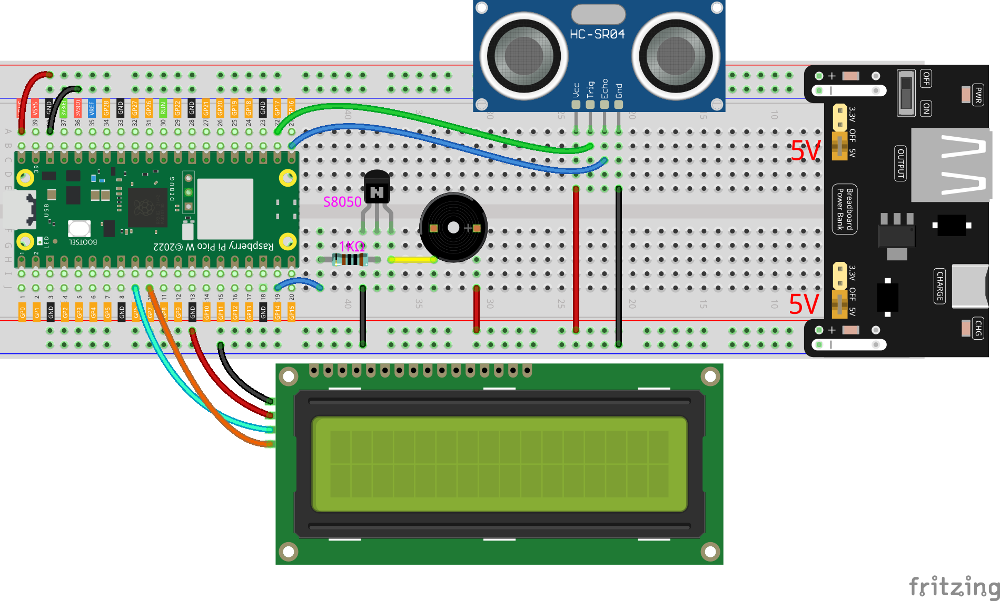

.. note::

    こんにちは、SunFounderのRaspberry Pi & Arduino & ESP32愛好家コミュニティへようこそ！Facebook上でRaspberry Pi、Arduino、ESP32についてもっと深く掘り下げ、他の愛好家と交流しましょう。

    **参加する理由は？**

    - **エキスパートサポート**：コミュニティやチームの助けを借りて、販売後の問題や技術的な課題を解決します。
    - **学び＆共有**：ヒントやチュートリアルを交換してスキルを向上させましょう。
    - **独占的なプレビュー**：新製品の発表や先行プレビューに早期アクセスしましょう。
    - **特別割引**：最新製品の独占割引をお楽しみください。
    - **祭りのプロモーションとギフト**：ギフトや祝日のプロモーションに参加しましょう。

    👉 私たちと一緒に探索し、創造する準備はできていますか？[|link_sf_facebook|]をクリックして今すぐ参加しましょう！

リバースパーキングアラームシステム（Pico W使用）
====================================================================

このプロジェクトでは、I2C LCD1602、ブザー、および超音波モジュールを使用して、バックアップ支援システムを構築します。これをリモコンカーに取り付けて、車庫へのバック駐車プロセスをシミュレーションすることができます。

**必要なコンポーネント**

本プロジェクトで必要なコンポーネントは以下の通りです。

* Raspberry Pi Pico W
* I2C LCD1602
* 超音波モジュール
* 1k レジスター
* S8050 NPN トランジスタ
* アクティブブザー
* |link_breadvolt|
* 800ホールズ・ブレッドボード
* ジャンパーワイヤー

**配線図**

**コード**

.. code-block:: Python

    import machine
    import time
    import _thread
    from lcd1602 import LCD

    # GPIO pin setup
    TRIG = machine.Pin(17, machine.Pin.OUT)
    ECHO = machine.Pin(16, machine.Pin.IN)
    BUZZER = machine.Pin(14, machine.Pin.OUT)
    SDA = machine.Pin(6)
    SCL = machine.Pin(7)

    # I2C setup for LCD1602
    i2c = machine.I2C(0, scl=SCL, sda=SDA)
    lcd = LCD(i2c)

    dis = 100

    def distance():
        timeout = 10000 * 5 / 340
        TRIG.low()
        time.sleep_us(2)
        TRIG.high()
        time.sleep_us(10)
        TRIG.low()
        timeout_start = time.ticks_ms()  # For timeout, re-read distance
        while not ECHO.value():
            waiting_time = time.ticks_ms()
            if waiting_time - timeout_start > timeout:
                return -1
        time1 = time.ticks_us()
        while ECHO.value():
            waiting_time = time.ticks_ms()
            if waiting_time - timeout_start > timeout:
                return -1
        time2 = time.ticks_us()
        during = time.ticks_diff(time2, time1)
        return during * 340 / 2 / 10000

    def ultrasonic_thread():
        global dis
        while True:
            dis = distance()

    _thread.start_new_thread(ultrasonic_thread, ())

    def beep():
        BUZZER.high()
        time.sleep(0.1)
        BUZZER.low()
        time.sleep(0.1)

    intervals = 10000000
    previousMills = time.ticks_ms()
    time.sleep(1)

    while True:
        if dis < 0:
            lcd.message("Error in\nmeasurement")
        else:
            lcd.clear()
            lcd.message(f"Distance: {dis:.2f} cm")
            if dis <= 10:
                intervals = 300
            elif dis <= 20:
                intervals = 500
            elif dis <= 50:
                intervals = 1000
            else:
                intervals = 2000

        currentMills = time.ticks_ms()
        if time.ticks_diff(currentMills, previousMills) >= intervals:
            beep()
            previousMills = currentMills

        time.sleep_ms(100)

* プログラムが実行されると、超音波センサーが常に前方の障害物までの距離を読み取り、シェル上で正確な距離値を確認できます。
* LEDとブザーは距離値に応じて点滅とビープ音の頻度を変え、障害物の接近を示します。
* 超音波センサーが動作すると、プログラムが一時停止します。LEDやブザーのタイミングに干渉しないように、この例では測距用に別のスレッドを作成しました。

**ライブラリ**

ここでは ``lcd1602.py`` というライブラリを使用します。Thonnyで新しいコードを作成し、以下のコードをコピーしてRaspberry Pi Pico Wに保存してください。

.. code-block:: Python

    import machine
    import time

    class LCD():
        def __init__(self, addr=None, blen=1):
            sda = machine.Pin(6)
            scl = machine.Pin(7)
            self.bus = machine.I2C(1,sda=sda, scl=scl, freq=400000)
            #print(self.bus.scan())
            self.addr = self.scanAddress(addr)
            self.blen = blen
            self.send_command(0x33) # Must initialize to 8-line mode at first
            time.sleep(0.005)
            self.send_command(0x32) # Then initialize to 4-line mode
            time.sleep(0.005)
            self.send_command(0x28) # 2 Lines & 5*7 dots
            time.sleep(0.005)
            self.send_command(0x0C) # Enable display without cursor
            time.sleep(0.005)
            self.send_command(0x01) # Clear Screen
            self.bus.writeto(self.addr, bytearray([0x08]))

        def scanAddress(self, addr):
            devices = self.bus.scan()
            if len(devices) == 0:
                raise Exception("No LCD found")
            if addr is not None:
                if addr in devices:
                    return addr
                else:
                    raise Exception(f"LCD at 0x{addr:2X} not found")
            elif 0x27 in devices:
                return 0x27
            elif 0x3F in devices:
                return 0x3F
            else:
                raise Exception("No LCD found")

        def write_word(self, data):
            temp = data
            if self.blen == 1:
                temp |= 0x08
            else:
                temp &= 0xF7
            self.bus.writeto(self.addr, bytearray([temp]))
        
        def send_command(self, cmd):
            # Send bit7-4 firstly
            buf = cmd & 0xF0
            buf |= 0x04               # RS = 0, RW = 0, EN = 1
            self.write_word(buf)
            time.sleep(0.002)
            buf &= 0xFB               # Make EN = 0
            self.write_word(buf)

            # Send bit3-0 secondly
            buf = (cmd & 0x0F) << 4
            buf |= 0x04               # RS = 0, RW = 0, EN = 1
            self.write_word(buf)
            time.sleep(0.002)
            buf &= 0xFB               # Make EN = 0
            self.write_word(buf)
        
        def send_data(self, data):
            # Send bit7-4 firstly
            buf = data & 0xF0
            buf |= 0x05               # RS = 1, RW = 0, EN = 1
            self.write_word(buf)
            time.sleep(0.002)
            buf &= 0xFB               # Make EN = 0
            self.write_word(buf)

            # Send bit3-0 secondly
            buf = (data & 0x0F) << 4
            buf |= 0x05               # RS = 1, RW = 0, EN = 1
            self.write_word(buf)
            time.sleep(0.002)
            buf &= 0xFB               # Make EN = 0
            self.write_word(buf)
        
        def clear(self):
            self.send_command(0x01) # Clear Screen
            
        def openlight(self):  # Enable the backlight
            self.bus.writeto(self.addr,bytearray([0x08]))
            # self.bus.close()
        
        def write(self, x, y, str):
            if x < 0:
                x = 0
            if x > 15:
                x = 15
            if y < 0:
                y = 0
            if y > 1:
                y = 1

            # Move cursor
            addr = 0x80 + 0x40 * y + x
            self.send_command(addr)

            for chr in str:
                self.send_data(ord(chr))
        
        def message(self, text):
            #print("message: %s"%text)
            for char in text:
                if char == '\n':
                    self.send_command(0xC0) # next line
                else:
                    self.send_data(ord(char))

