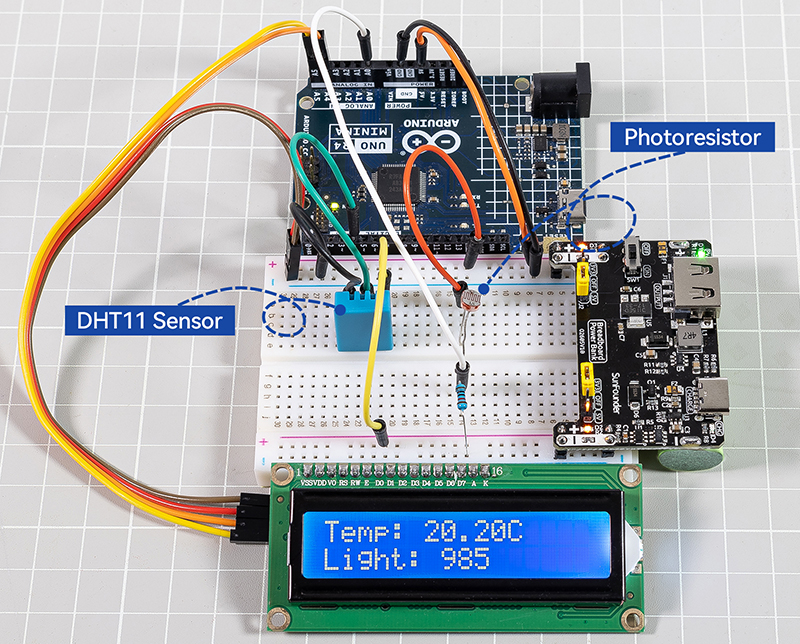
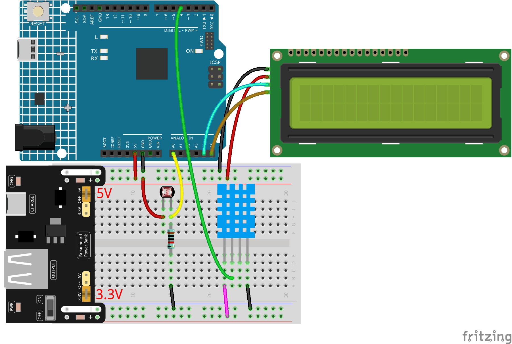

Environmental Monitoring System with Arduino
====================================================================

This project demonstrates how to create a simple yet effective monitoring system using an Arduino Uno R4 Minima, a DHT11 temperature and humidity sensor, a photoresistor, and an I2C LCD1602 display. The system reads the temperature and light intensity and displays the values on the LCD screen, making it a practical project for learning about sensor integration and I2C communication in embedded systems.

**Required Components**

In this project, we need the following components.

* Arduino Uno R4 Minima
* I2C LCD1602
* DHT11 Humiture Sensor
* Photoresistor
* 10k Resistor
* Breadboard Power Bank
* 400 Holes Breadboard
* Jumper Wires

**Wiring Diagram**

**Code**

.. note::

    The ``LiquidCrystal I2C`` and ``DHT sensor library`` libraries are used here, you can install them from the **Library Manager**.

.. code-block:: Arduino

    #include <Wire.h>
    #include <LiquidCrystal_I2C.h>
    #include <DHT.h>

    // Define the DHT11 sensor pin and type
    #define DHTPIN 4
    #define DHTTYPE DHT11

    // Create DHT object
    DHT dht(DHTPIN, DHTTYPE);

    // Create LCD object, set I2C address to 0x27, LCD size to 16x2
    LiquidCrystal_I2C lcd(0x27, 16, 2);

    void setup() {
        // Initialize serial communication
        Serial.begin(9600);
        Serial.println("DHT11 and Light Sensor Test!");

        // Initialize DHT sensor
        dht.begin();

        // Initialize LCD
        lcd.init();
        lcd.backlight(); // Turn on LCD backlight
    }

    void loop() {
        // Wait a few seconds between measurements
        delay(2000);

        // Reading temperature and humidity takes about 250 milliseconds
        // Sensor readings may also be up to 2 seconds 'old' (it's a very slow sensor)
        float humidity = dht.readHumidity();
        float temperature = dht.readTemperature(); // Read temperature as Celsius (default)

        // Read light level from the photoresistor
        int lightLevel = analogRead(A0);

        // Check if any reads failed and exit early (to try again)
        if (isnan(humidity) || isnan(temperature)) {
            Serial.println("Failed to read from DHT sensor!");
            return;
        }

        // Print the temperature and light level to the LCD
        lcd.clear();
        lcd.setCursor(0, 0); // Set cursor to column 0, line 0
        lcd.print("Temp: ");
        lcd.print(temperature);
        lcd.print(" C");
        
        lcd.setCursor(0, 1); // Set cursor to column 0, line 1
        lcd.print("Light: ");
        lcd.print(lightLevel);
    }

