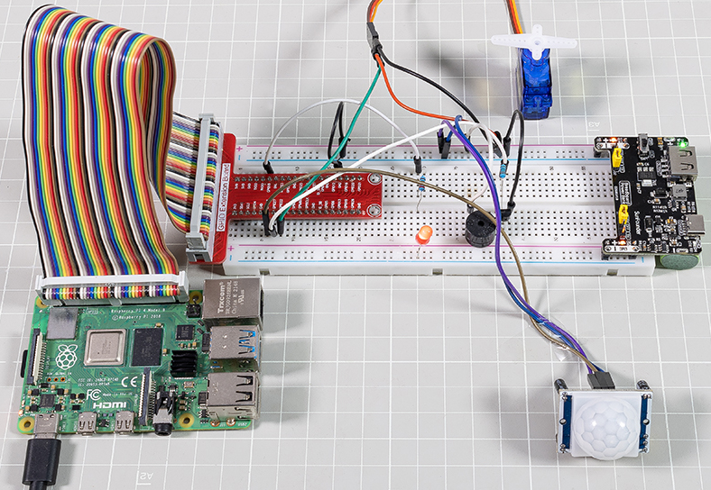
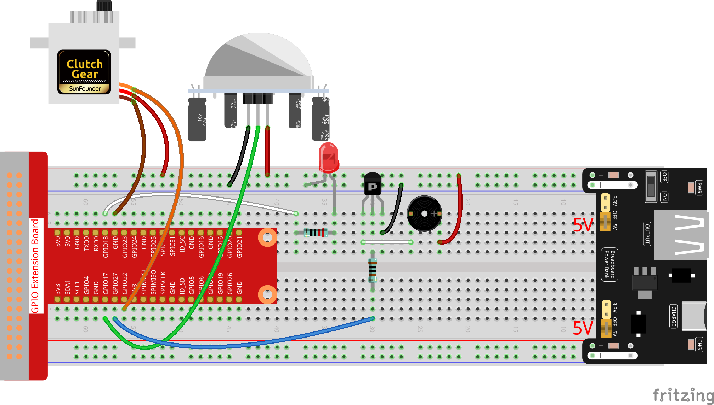

.. note::

    こんにちは、SunFounderのRaspberry Pi & Arduino & ESP32愛好家コミュニティへようこそ！Facebook上でRaspberry Pi、Arduino、ESP32についてもっと深く掘り下げ、他の愛好家と交流しましょう。

    **参加する理由は？**

    - **エキスパートサポート**：コミュニティやチームの助けを借りて、販売後の問題や技術的な課題を解決します。
    - **学び＆共有**：ヒントやチュートリアルを交換してスキルを向上させましょう。
    - **独占的なプレビュー**：新製品の発表や先行プレビューに早期アクセスしましょう。
    - **特別割引**：最新製品の独占割引をお楽しみください。
    - **祭りのプロモーションとギフト**：ギフトや祝日のプロモーションに参加しましょう。

    👉 私たちと一緒に探索し、創造する準備はできていますか？[|link_sf_facebook|]をクリックして今すぐ参加しましょう！

ラズベリーパイを使用した自動入口システム
====================================================================

このプロジェクトでは、PIRを使用して歩行者の動きを感知し、サーボ、LED、ブザーを使用してコンビニのセンサードアの動作をシミュレートします。歩行者がPIRの感知範囲内に現れると、インジケーターライトが点灯し、ドアが開き、ブザーが開店のベルを鳴らします。

**必要なコンポーネント**

このプロジェクトには、以下のコンポーネントが必要です。

* Raspberry Pi
* GPIO拡張ボード
* レジスター
* LED
* PIRモーションセンサーモジュール
* サーボ
* ブザー
* トランジスタ
* |link_breadvolt|
* 800穴のブレッドボード
* ジャンパーワイヤー

**配線図**

**コード**

.. code-block:: Python

    #!/usr/bin/env python3

    from gpiozero import LED, MotionSensor, Servo, TonalBuzzer
    import time

    # GPIO pin setup for LED, motion sensor (PIR), and buzzer
    ledPin = LED(6)
    pirPin = MotionSensor(21)
    buzPin = TonalBuzzer(27)

    # Servo motor pulse width correction factor and calculation
    myCorrection = 0.45
    maxPW = (2.0 + myCorrection) / 1000  # Maximum pulse width
    minPW = (1.0 - myCorrection) / 1000  # Minimum pulse width

    # Initialize servo with custom pulse widths
    servoPin = Servo(25, min_pulse_width=minPW, max_pulse_width=maxPW)

    # Musical tune for buzzer, with notes and durations
    tune = [('C#4', 0.2), ('D4', 0.2), (None, 0.2),
            ('Eb4', 0.2), ('E4', 0.2), (None, 0.6),
            ('F#4', 0.2), ('G4', 0.2), (None, 0.6),
            ('Eb4', 0.2), ('E4', 0.2), (None, 0.2),
            ('F#4', 0.2), ('G4', 0.2), (None, 0.2),
            ('C4', 0.2), ('B4', 0.2), (None, 0.2),
            ('F#4', 0.2), ('G4', 0.2), (None, 0.2),
            ('B4', 0.2), ('Bb4', 0.5), (None, 0.6),
            ('A4', 0.2), ('G4', 0.2), ('E4', 0.2),
            ('D4', 0.2), ('E4', 0.2)]

    def setAngle(angle):
        """
        Move the servo to a specified angle.
        :param angle: Angle in degrees (0-180).
        """
        value = float(angle / 180)  # Convert angle to servo value
        servoPin.value = value      # Set servo position
        time.sleep(0.001)           # Short delay for servo movement

    def doorbell():
        """
        Play a musical tune using the buzzer.
        """
        for note, duration in tune:
            buzPin.play(note)       # Play the note
            time.sleep(float(duration))  # Duration of the note
        buzPin.stop()               # Stop buzzer after playing the tune

    def closedoor():
        # Turn off LED and move servo to close door
        ledPin.off()
        for i in range(180, -1, -1):
            setAngle(i)             # Move servo from 180 to 0 degrees
            time.sleep(0.001)       # Short delay for smooth movement
        time.sleep(1)               # Wait after closing door

    def opendoor():
        # Turn on LED, open door (move servo), play tune, close door
        ledPin.on()
        for i in range(0, 181):
            setAngle(i)             # Move servo from 0 to 180 degrees
            time.sleep(0.001)       # Short delay for smooth movement
        time.sleep(1)               # Wait before playing the tune
        doorbell()                  # Play the doorbell tune
        closedoor()                 # Close the door after the tune

    def loop():
        # Main loop to check for motion and operate door
        while True:
            if pirPin.motion_detected:
                opendoor()               # Open door if motion detected
            time.sleep(0.1)              # Short delay in loop

    try:
        loop()
    except KeyboardInterrupt:
        # Clean up GPIO on user interrupt (e.g., Ctrl+C)
        buzPin.stop()
        ledPin.off()

コードが実行されると、PIRセンサーが通行人を検出すると、ドアが自動的に開き（サーボでシミュレート）、インジケーターを点灯させ、ドアベルの音楽を再生します。ドアベルの音楽が鳴った後、システムは自動的にドアを閉じ、インジケーターライトを消し、次に誰かが通り過ぎるのを待ちます。